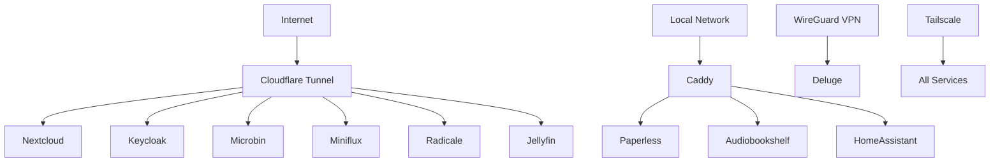

# **LabHome NixOS Server Configuration**

A comprehensive NixOS configuration for a home server with multiple self-hosted services, VPN integration, and modern security features including YubiKey authentication.

## **🏗️ Architecture Overview**

### **Core Technologies**
- **Operating System**: NixOS (Declarative Linux Distribution)
- **Reverse Proxy**: Caddy (Local) + Cloudflare Tunnel (External)
- **DNS**: NextDNS (nextdns0.dns.nextdns.io) with DNS-over-TLS
- **VPN**: Tailscale (Mesh networking) + PIA WireGuard (Deluge isolation)
- **Secrets Management**: SOPS-nix with Age encryption
- **User Environment**: Home Manager with ZSH + NvChad
- **Authentication**: Keycloak with YubiKey/WebAuthn support

### **Service Architecture**



## **🌐 Hosted Services**

### **External Access (via Cloudflare Tunnel)**
| Service | URL | Port | Description |
|---------|-----|------|-------------|
| **Nextcloud** | `nextcloud.example.com` | 8081 | File sync & collaboration platform |
| **Keycloak** | `keycloak.example.com` | 8080 | Identity & access management with YubiKey |
| **Microbin** | `paste.example.com` | 8083 | Private pastebin service |
| **Miniflux** | `rss.example.com` | 8084 | Minimalist RSS feed reader |
| **Radicale** | `cal.example.com` | 5232 | CalDAV/CardDAV server |
| **Jellyfin** | `jellyfin.example.com` | 8096 | Media streaming with GPU acceleration |

### **Local Network Only (via Caddy)**
| Service | URL | Port | Description |
|---------|-----|------|-------------|
| **Paperless-ngx** | `paperless.example.com` | 8082 | Document management system |
| **Audiobookshelf** | `audiobookshelf.example.com` | 8085 | Audiobook & podcast server |
| **Home Assistant** | `homeassistant.example.com` | 8123 | Home automation platform |

### **Background Services**
| Service | Port | Access | Description |
|---------|------|--------|-------------|
| **Deluge** | 8112 | VPN-isolated | BitTorrent client with PIA VPN |
| **PostgreSQL** | 5432 | Internal | Database for multiple services |
| **SSH** | 22 | Key-based auth | Remote administration |
| **Fail2ban** | - | Background | Intrusion prevention system |
| **Tailscale** | - | VPN mesh | Secure remote access |

## **🔧 Hardware Requirements**

### **Minimum Specifications**
- **CPU**: Intel i5-6500 or newer (Intel GPU required for Jellyfin acceleration)
- **RAM**: 8GB minimum (16GB+ recommended for multiple services)
- **Storage**: 
  - 100GB+ SSD for system
  - Additional storage for media and user data
- **Network**: Gigabit Ethernet connection
- **USB**: Port for YubiKey authentication

### **Hardware Features Enabled**
- ✅ Intel GPU hardware acceleration (VA-API) for Jellyfin
- ✅ YubiKey/FIDO2 authentication support
- ✅ PC/SC smart card daemon for hardware tokens
- ✅ Hardware monitoring and thermal management

## **🚀 Quick Start Installation**

### **1. Prerequisites**
```bash
# Download NixOS minimal ISO
# Boot from USB and run:
sudo -i
```

### **2. Clone and Install**
```bash
# Clone the configuration
git clone <your-repo-url> /mnt/etc/nixos
cd /mnt/etc/nixos

# Install system
nixos-install --flake .#homeserver

# Reboot
reboot
```

### **3. Initial Setup**
```bash
# Setup SOPS age key (after first boot)
mkdir -p ~/.config/sops/age
# Add your age private key to ~/.config/sops/age/keys.txt

# Configure secrets
sops secrets.yaml

# Rebuild with secrets
sudo nixos-rebuild switch --flake /etc/nixos
```

## **🔐 Security & Authentication**

### **Multi-Factor Authentication**
- **YubiKey Support**: WebAuthn/FIDO2 integration with Keycloak
- **SSH Keys Only**: Password authentication disabled
- **Encrypted Secrets**: All sensitive data encrypted with SOPS
- **VPN Isolation**: Deluge runs in isolated WireGuard namespace

### **Network Security**
- **Cloudflare Protection**: DDoS mitigation and SSL termination
- **Fail2ban**: Automated intrusion detection and prevention
- **Firewall**: Minimal attack surface with NixOS firewall
- **DNS Security**: NextDNS with malware/tracker blocking

### **Access Control Matrix**
| Service | Local | Tailscale | Cloudflare | Auth Required |
|---------|-------|-----------|------------|---------------|
| Nextcloud | ❌ | ✅ | ✅ | Keycloak SSO |
| Keycloak | ❌ | ✅ | ✅ | YubiKey + Password |
| Jellyfin | ❌ | ✅ | ✅ | Local account |
| Home Assistant | ✅ | ✅ | ❌ | Local account |
| Paperless | ✅ | ✅ | ❌ | Local account |
| SSH | ✅ | ✅ | ❌ | Key-based only |

## **📁 Project Structure**

```
/etc/nixos/
├── 📄 flake.nix                    # Flake configuration and inputs
├── 📄 configuration.nix            # Main system configuration
├── 📄 disko.nix                   # Declarative disk partitioning
├── 📄 networking.nix              # Network and DNS configuration
├── 📄 home.nix                    # Home Manager user environment
├── 🔒 secrets.yaml                # SOPS encrypted secrets
├── 📁 services/                   # Service configurations
│   ├── 🌐 cloudflared.nix         # Cloudflare Tunnel
│   ├── 🌐 caddy.nix               # Local reverse proxy
│   ├── 📥 deluge-vpn.nix          # VPN-isolated torrenting
│   ├── 🛡️ fail2ban.nix            # Intrusion prevention
│   ├── 🏠 home-assistant.nix      # Home automation
│   ├── 🎬 jellyfin.nix            # Media streaming
│   ├── 🔑 keycloak.nix            # Identity management
│   ├── 🎵 media-content.nix       # Audiobookshelf, Miniflux, Microbin
│   ├── ☁️ nextcloud.nix           # File synchronization
│   ├── 📄 paperless.nix           # Document management
│   ├── 📅 radicale.nix            # Calendar/contacts
│   ├── 🔗 tailscale.nix           # VPN mesh networking
│   ├── 📱 tg-notify.nix           # Telegram notifications
│   └── 🔐 yubikey.nix             # Hardware authentication
└── 📁 scripts/                   # Management scripts
    └── keycloak-yubikey-setup.nix
```

## **🛠️ Management & Operations**

### **System Management**
```bash
# Update system
sudo nixos-rebuild switch --flake /etc/nixos

# Update flake inputs
nix flake update

# Check system status
systemctl status

# View system logs
journalctl -f
```

### **Service Management**
```bash
# Service status
systemctl status keycloak
systemctl status jellyfin
systemctl status tailscale

# Service logs
journalctl -u nextcloud -f
journalctl -u home-assistant -n 100

# Restart services
sudo systemctl restart caddy
sudo systemctl restart cloudflared
```

### **Secret Management**
```bash
# Edit encrypted secrets
sops secrets.yaml

# Reload secrets (automatic on rebuild)
sudo nixos-rebuild switch --flake /etc/nixos

# Check secret access
sudo ls -la /run/secrets/
```

### **Backup Strategy**
```bash
# Essential directories to backup:
/etc/nixos/                    # Configuration (this repo)
/home/zeev/                    # User data
/var/lib/postgresql/           # Databases
/var/lib/nextcloud/           # Nextcloud data
~/.config/sops/age/           # Encryption keys
```

## **🌐 Access Information**

### **Web Interfaces**
- **Nextcloud**: https://nextcloud.example.com
- **Keycloak**: https://keycloak.example.com
- **Jellyfin**: https://jellyfin.example.com
- **Home Assistant**: https://homeassistant.example.com
- **Paperless**: https://paperless.example.com
- **Audiobookshelf**: https://audiobookshelf.example.com

### **Mobile Apps**
- **Nextcloud**: iOS/Android apps available
- **Home Assistant**: Companion apps for iOS/Android
- **Jellyfin**: Mobile apps for media streaming
- **Tailscale**: Mobile VPN access

### **Desktop Integration**
- **Nextcloud**: Desktop sync clients
- **Radicale**: CalDAV/CardDAV in calendar/contact apps
- **SSH**: Terminal access with key authentication

## **🔧 Troubleshooting Guide**

### **Common Issues**

#### **Service Won't Start**
```bash
# Check service status and logs
systemctl status <service-name>
journalctl -u <service-name> -n 50

# Check dependencies
systemctl list-dependencies <service-name>
```

#### **DNS Resolution Issues**
```bash
# Check DNS configuration
resolvectl status
systemctl status systemd-resolved

# Test DNS resolution
nslookup google.com
dig @45.90.28.0 google.com
```

#### **Secret Access Problems**
```bash
# Verify secrets are accessible
sudo ls -la /run/secrets/
sudo cat /run/secrets/nextcloud_admin_password

# Restart SOPS if needed
sudo systemctl restart sops-nix
```

#### **YubiKey Not Working**
```bash
# Check USB device detection
lsusb | grep Yubico

# Restart PC/SC daemon
sudo systemctl restart pcscd

# Test YubiKey functionality
ykman info
```

#### **Network Connectivity**
```bash
# Check Tailscale status
sudo tailscale status

# Test Cloudflare tunnel
sudo cloudflared tunnel info homeserver

# Check local network services
curl -I http://localhost:8080  # Keycloak
curl -I http://localhost:8081  # Nextcloud
```

### **Emergency Access**
1. **Physical Console**: Direct server access
2. **SSH**: `ssh zeev@<server-ip>` (key-based)
3. **Tailscale**: VPN access even if main services are down
4. **Recovery Mode**: Boot into NixOS rescue mode

### **Performance Monitoring**
```bash
# System resources
htop
iotop
nethogs

# Service-specific logs
journalctl -u jellyfin -f     # Media transcoding
journalctl -u postgresql -f   # Database performance
journalctl -u caddy -f        # Web server access
```

## **🔄 Update & Maintenance**

### **Regular Maintenance Tasks**
- **Weekly**: Update flake inputs and rebuild system
- **Monthly**: Review fail2ban logs and security events
- **Quarterly**: Update Cloudflare tunnel configuration
- **As needed**: Rotate secrets and authentication keys

### **System Updates**
```bash
# Update flake inputs
nix flake update

# Rebuild system
sudo nixos-rebuild switch --flake /etc/nixos

# Check for issues
journalctl -b | grep -i error
systemctl --failed
```

## **🔑 Initial Configuration Steps**

### **1. Cloudflare Tunnel Setup**
```bash
# Login to Cloudflare
cloudflared login

# Create tunnel
cloudflared tunnel create homeserver

# Get tunnel credentials and add to secrets.yaml
```

### **2. Tailscale Configuration**
```bash
# Service starts automatically with auth key from secrets
# Check status
sudo tailscale status

# Enable key features
sudo tailscale set --accept-dns --accept-routes --ssh
```

### **3. YubiKey Setup**
```bash
# Run setup script
setup-keycloak-yubikey

# Follow Keycloak admin console instructions:
# 1. Enable WebAuthn authenticators
# 2. Configure authentication flows
# 3. Set up user security keys
```

### **4. Service-Specific Setup**

#### **Nextcloud**
- Access https://nextcloud.example.com
- Login with admin credentials from secrets
- Configure external storage, apps, and user accounts

#### **Home Assistant**
- Access https://homeassistant.example.com
- Complete initial setup wizard
- Configure integrations and automations

#### **Jellyfin**
- Access https://jellyfin.example.com
- Complete setup wizard
- Configure media libraries (/home/zeev/media)

## **📚 Documentation & Resources**

### **NixOS Resources**
- [NixOS Manual](https://nixos.org/manual/nixos/stable/)
- [Home Manager Manual](https://nix-community.github.io/home-manager/)
- [SOPS-nix Documentation](https://github.com/Mic92/sops-nix)

### **Service Documentation**
- [Keycloak Admin Guide](https://www.keycloak.org/docs/latest/server_admin/)
- [Nextcloud Admin Manual](https://docs.nextcloud.com/server/latest/admin_manual/)
- [Jellyfin Documentation](https://jellyfin.org/docs/)
- [Home Assistant Docs](https://www.home-assistant.io/docs/)

### **Security Resources**
- [YubiKey Setup Guide](https://developers.yubico.com/WebAuthn/)
- [Cloudflare Tunnel Docs](https://developers.cloudflare.com/cloudflare-one/connections/connect-apps/)
- [Tailscale Documentation](https://tailscale.com/kb/)

## **🤝 Contributing**

This configuration is designed for personal use but can be adapted for similar setups. Key areas for customization:

1. **Domain Names**: Update `example.com` to your domain
2. **User Accounts**: Modify user configurations in `configuration.nix`
3. **Service Selection**: Enable/disable services based on needs
4. **Hardware**: Adjust GPU and hardware-specific settings
5. **Secrets**: Generate your own encryption keys and secrets

## **⚠️ Security Considerations**

- **Change Default Passwords**: All default passwords in secrets.yaml must be changed
- **SSH Keys**: Upload your public SSH key before disabling password auth
- **Firewall**: Review and adjust firewall rules for your network
- **Backups**: Implement regular backups of critical data
- **Updates**: Keep system and services updated regularly

## **📄 License**

This configuration is provided under the MIT license for educational and personal use. Individual services maintain their respective licenses.

---

**🏠 Built with ❤️ for the home lab community**

*Last updated: July 2025*
