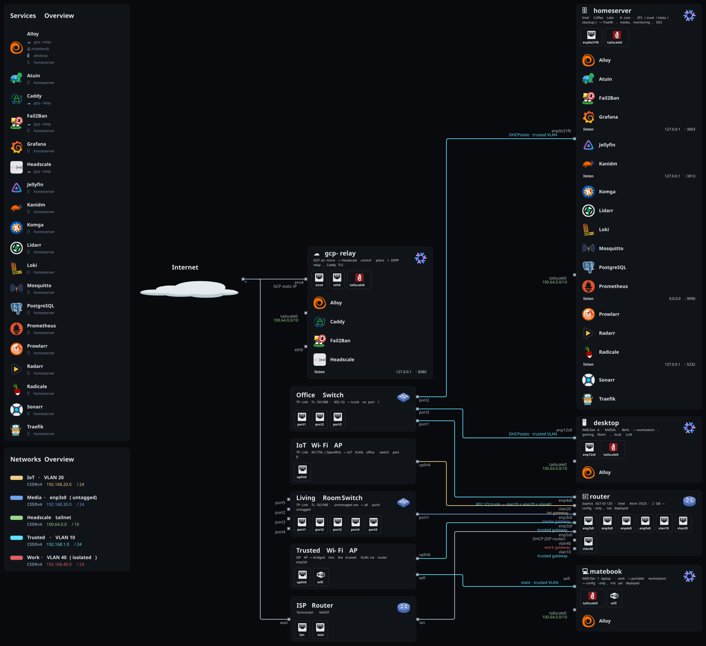
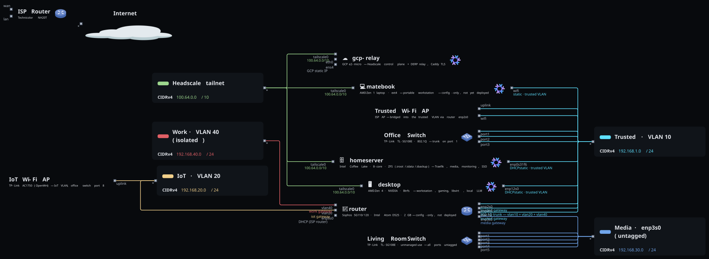

<h1 align="center">nix-config</h1>

<p align="center"><em>4rmcyt's NixOS fleet — five machines, one flake, zero hand-editing.</em></p>

<p align="center">
  
  
  
  
  
  <a href="https://github.com/4rmcyt/nix-config/actions/workflows/ci.yml"></a>
</p>

A [flake-parts](https://flake.parts) + [`import-tree`](https://github.com/vic/import-tree)
configuration that builds and deploys every machine I run. Each host is a
composition of small single-responsibility modules; identity and LAN topology
live in a separate private flake so this repo can stay public.

## 🖥️ Hosts

<table>
  <tr><td><strong>desktop</strong></td><td>AMD Zen 4 + NVIDIA workstation. Wayland via <strong>mango</strong> + <strong>noctalia</strong>, gaming, libvirt, waydroid, local LLM, CUDA caches.</td></tr>
  <tr><td><strong>matebook</strong></td><td>AMD Zen 1 laptop. <strong>niri</strong> + noctalia, Limine + Secure Boot, suspend-then-hibernate, auto-cpufreq.</td></tr>
  <tr><td><strong>homeserver</strong></td><td>Intel Coffee Lake. Every service: Traefik, media stack (nixarr), Postgres / Redis / CouchDB, Prometheus/Grafana/Loki, Kanidm, CrowdSec, restic.</td></tr>
  <tr><td><strong>gcp-relay</strong></td><td>GCP <code>e2-micro</code>. <strong>Headscale</strong> control plane + DERP server, Caddy TLS, fail2ban, hardened.</td></tr>
  <tr><td><strong>router</strong></td><td>Sophos SG appliance (Intel Atom). nftables firewall, Kea DHCP, Unbound, VLAN segmentation, mDNS reflector. Headless, no HM.</td></tr>
</table>

```bash
# build one host locally
nix build .#nixosConfigurations.<host>.config.system.build.toplevel
# deploy a host (targets defined in the justfile)
just deploy-homeserver
```

## 🌐 Topology

Generated from the NixOS configs with
[nix-topology](https://github.com/oddlama/nix-topology) — per-host annotations in
[`modules/topology/`](modules/topology/default.nix), the global picture (internet,
ISP router, switches, APs, network CIDRs) in
[`parts/topology.nix`](parts/topology.nix). Regenerate with `just topology`.
Interface labels are deliberately IP-free — the diagrams expose nothing beyond
[`docs/Infrastructure.md`](docs/Infrastructure.md).

**Physical**

<a href="docs/topology.svg"></a>

**Network-centric**

<a href="docs/topology-network.svg"></a>

## 🧩 Repository layout

-  — ~15 lines; delegates to `import-tree ./parts`
-  — flake-parts modules, auto-imported
  - `owner.nix` — private identity/topology → `meta.owner.*`
  - `meta.nix` / `flake-parts-modules.nix` — internal options (`meta`, `modules`)
  - `shared-nixos-settings.nix` — nix daemon, caches, sops, access tokens
  - `hm.nix` / `workstation.nix` — HM wiring / facter + ucodenix + gnupg (both opt-in)
  - `topology.nix` — nix-topology wiring + global topology
  - `configurations/` — `configurations.nixos.<name>` → `nixosConfigurations`
  - `hosts/<host>/` — per-host module composition
-  — per-host `hardware-configuration.nix`, `facter.json`, NixOS config
-  — Home Manager config per host
-  — ~190 single-purpose modules, imported explicitly
  - `options/` — `my.defaults.*` · `my.network.*` · `my.security.*`
  - `base/` · `roles/` — core system · role compositions
  - `WM/` · `GUI/` · `TUI/` — mango · niri · noctalia · firefox · zsh · ai-tools
  - `services/` — nixarr · homepage · miniflux · hass · komga · ntfy
  - `networking/` — traefik · caddy · headscale · tailscale · unbound
  - `security/` · `monitoring/` · `database/` — kanidm/crowdsec · grafana/loki · postgres/redis
  - `disko/` · `backup/` · `containers/` · `nix/` — disks · restic · podman · lix
-  — sops-encrypted YAML/env (age)
-  — OpenTofu: GCP static IP + instance
-  — Architecture · Infrastructure · CI-CD · hardware notes

## 🔧 How a host is assembled

`parts/hosts/<host>/configuration.nix` declares a `configurations.nixos.<name>.module`;
`parts/configurations/nixos.nix` turns it into `flake.nixosConfigurations.<name>`.
Each host imports:

- **`modules.nixos.base`** — nix settings, binary caches, sops, HM wiring
- **`modules.nixos.hm`** — Home Manager (skipped on router + gcp-relay)
- **`modules.nixos.workstation`** — microcode, facter, gnupg (skipped on router + gcp-relay)
- its own `hosts/nixos/<host>/` tree + whatever flake-input modules it needs

`deferredModule` merge semantics let several `parts/` files contribute to the
same base.

## 🔐 Conventions

- **Metadata** — `config.meta.owner.*` (flake-parts scope) / `config.my.defaults.*`
  (NixOS scope) resolve from the private `private` flake input. Never hardcoded;
  schema in [`modules/options/private-example.nix`](modules/options/private-example.nix).
- **Secrets** — [sops-nix](https://github.com/Mic92/sops-nix) + age, referenced as
  `config.sops.secrets.<name>.path`. Plaintext never enters the repo.
- **Formatting** — `nix fmt` runs [treefmt](treefmt.nix) (alejandra, deadnix,
  statix, prettier, shfmt, yamlfmt, toml-sort, rustfmt).
- **Commits** — Conventional: `type(scope): description`, scope = module or host.
- **Boundary** — system config in `modules/`, user config in `home/`.
- **Never guess config keys** — read the upstream schema first.

## 📡 Networking & remote access

- **Tailnet** — all machines join a self-hosted [Headscale](https://headscale.net);
  control plane + a DERP region run on **gcp-relay**. homeserver advertises its
  LAN subnet + an exit node; router advertises the media VLAN.
- **DNS** — Unbound on router and homeserver, split DNS for the private domain,
  NextDNS DoT upstream.
- **Ingress** — public traffic to homeserver terminates at **Traefik** (Cloudflare
  DNS-01 wildcard cert, CrowdSec bouncer); a few services also go through a
  Cloudflare Tunnel.

<details>
<summary>Published behind Traefik (<code>*.&lt;domain&gt;</code>)</summary>

`home` · `grafana` · `miniflux` · `hass` · `jellyfin` · `sonarr` / `radarr` /
`prowlarr` / `bazarr` / `lidarr` / `seerr` / `qb` · `audiobookshelf` ·
`lazylibrarian` · `kapowarr` · `komga` / `komf` · `dispatcharr` · `atuin` ·
`ntfy` · `cal` · `microbin` · `livesync` · `idm` · `jobko` · `traefik`

</details>

## 🤖 Local inference

[`modules/TUI/ai-tools/llama-cpp/`](modules/TUI/ai-tools/llama-cpp/default.nix) —
`llama-server` as a user service on `127.0.0.1`, models pinned as `fetchurl` GGUFs
(no runtime downloads):

- **desktop** `default.nix` — Gemma 4 E4B on CUDA (`:8080`, all layers offloaded,
  16K ctx, flash-attn), unloads after 15 min idle. Companion `mcp-proxy` (`:8081`)
  bridges `~/.config/mcp/mcp.json` into the llama web UI.
- **desktop** `qwen32b-cpu.nix` — Qwen2.5-32B on CPU (`:8090`), on-demand only
  (~28 GB, no `WantedBy`); started/stopped by the fairy-tale pipeline's
  `generate_story.py`, unloads after 5 min idle.
- **matebook** `cpu.nix` — Qwen2.5-3B on CPU (`:8080`, 8K ctx, 4 GB cap).

## 🔁 CI

[`.github/workflows/ci.yml`](.github/workflows/ci.yml) orchestrates reusable workflows:

```
flake-lock-update (schedule/dispatch only)
  ├─ validate          nix fmt + flake check     (non-blocking, Telegram warn)
  └─ security-checks   Trivy · TruffleHog · SOPS (hard gate)
       └─ build-and-check-systems   build: homeserver, matebook, gcp-relay
            └─ workflow-summary     Telegram notification
vulnix-scan (schedule/dispatch only)   CVE scan of a built closure
```

`desktop` is excluded from CI builds — its GUI/CUDA closure exceeds GitHub runner
limits; it's built on the machine. Per-host builds push to per-host Cachix caches
(`4rmcyt-<host>.cachix.org`).

## 🛠️ Local development

```bash
nix develop          # tooling shell: sops, age, gitleaks, ripsecrets, nh, nix-tree, …
nix fmt              # format everything
nix flake check      # validate outputs
just topology        # regenerate the topology SVGs
```

## 📦 Key inputs

**Core** &nbsp;


**System** &nbsp;


**Desktop** &nbsp;


**Services** &nbsp;


**Tooling** &nbsp;


**Private** &nbsp;


## 📚 Docs

| File | Covers |
|------|--------|
| [Architecture.md](docs/Architecture.md) | Flake structure, `parts/`, module layout, options system |
| [Infrastructure.md](docs/Infrastructure.md) | Homeserver services, ZFS layout, ports, networking |
| [CI-CD.md](docs/CI-CD.md) | Full pipeline diagram and per-workflow detail |
| [gcp.md](docs/gcp.md) | gcp-relay deploy + first-boot |
| [router-installation.md](docs/router-installation.md) · [efi.md](docs/efi.md) · [bios-desktop-settings.md](docs/bios-desktop-settings.md) | Hardware / firmware notes |
